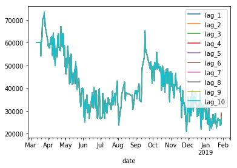

# Machine Learning Engineer Nanodegree
## Capstone Project
Muhammad Hakami  
February 12st, 2019

## I. Definition
_(approx. 1-2 pages)_

### Project Overview

-The problem at hand is a time series prediction, given a history data about prices predict the future price.

-The prediction is in-game price prediction for an item, as I trade in the game it came to me to make a prediction model to increase profit.

-The data related to the problem has been scraped from a fan based website called ffxivmb.com.

### Problem Statement

-I'm trying to predict wither the market will go up or down to but and sell at appropriate times.

-I will use ARIMA model which is a model that uses the previous time stamp to predict the future, and I will frame the problem to be supervised learning problem and apply some of the supervised algorithms.

### Metrics

The main metric to my models will be R2 score, it's calculated by dividing the sum of square error of my model over the baseline's minus 1, achieving 1 means perfect model, 0 means it preforms as the bassline and minus score for worst than baseline performance.

## II. Analysis
_(approx. 2-4 pages)_

### Data Exploration

-The data contains the date of purchase by seconds, price, name(name in game not real), and the quantity purchased, the feature of interest is price along datetime.

-The price seems to not have stationarity, while the partial autocorrelation seems to conclude that the second lag is of use to us, while the autocorrelation shows the data has great correlation with it's lags meaning we can get great accuracy by using the lags.

-While the data can't be found by an API, I scraped it from a website called ffxivmb.com.

-Since the data has a random intervals I decided to resample it to include a 49 minutes intervals so I could pinpoint the time of prediction given lag.

### Exploratory Visualization

-The y axis indicates the price of the item.

-We can see a general trend from the plot and variant frequency, which indicates the need to differentiate so we can reach stationarity.

### Algorithms and Techniques

-The first one will be ARIMA which is an algorithm that predict the future time stamp based upon the previous time stamp, it has two main parameters Auto Regression(AR) and Moving Average(MA) along with the integration which is a differentiation so we could reach stationarity, the AR says the future time stamps equal the past plus noise, the MA says the future equals the average of the previous window plus noise, so when we add them all we call it ARIMA.

-The second area of algorithms is some supervised algorithms that we use with a lag from the data to predict the next time stamp. I will use Linear Regression which is an algorithm that tries to fit the line of best fit into the data points, and Random Forest which is an algorithm that tries to segment the data based upon specific characteristics to find the position for each data point.

-The last algorithm is Long-Short term Memory (LSTM) which is deep learning algorithm that decides the predictions based upon two types of memories, the first is the long term memory it remembers characteristics for a long time, while the second is the short term memory which has short memory span both are used to evaluate the Regression task.

### Benchmark

The idea is my own making so I don't have another person to evaluate from, so I will make the optimized ARIMA model I built as a benchmark. beating it means achieving a passing result for a model.

## III. Methodology
_(approx. 3-5 pages)_

### Data Preprocessing

The numbers within the data has commas so I deleted and change into floats, also to know the prediction window for the supervised settings I resampled the data to have a 49 minutes intervals, and removed the outliers in this case being outliers in the percentage of change.

### Implementation

-For the ARIMA model based upon the autocorrelation and partial autocorrelation we can decide the AR and MA values, but I also tested BIC score for many points to see the best parameters.

-As for the supervised algorithms I extracted the lag and the min, max, percentiles, along with standard deviation for all lags.

### Refinement

Within the ARIMA the model was improved to reach far better results, with the search of optimal AR and MA values based upon the value of BIC.

## IV. Results
_(approx. 2-3 pages)_

### Model Evaluation and Validation

I concluded that this problem is too simple to use LSTM so my final model will be the Linear Regression, as the data seems to have some linearity, seeing the autocorrelation I expected the linear model to preform as such. the data was split using the cross-validation that is appropriate for time series as it split the test in a continues manner. seeing the results of the cross-validation, we can see the scores has very low minimum while the rest seems to be close to the mean due to the first separation having low data in the split as expected from the Time split function. and yes the result should be trusted as the cross validate seems to be doing well.

### Justification

Modeling report:
'ARIMA': 0.21531721669191006,
'Linear Regression': 0.8285231488158044,
'Random Forest': 0.5517316503951851,
'LSTM with dates only no lags': 0.751582332202349

we can see the Linear Regression scored better than the benchmark which was the ARIMA, I only used the first lag in the models other that LSTM, and due to the nature of my dataset having very close lags it was expected that the lags will provide very high accuracy but very small prediction window. with this accuracy at hand we can predict wither the market will go up or down which solves our problem.

## V. Conclusion
_(approx. 1-2 pages)_

### Free-Form Visualization

y axis is the price.

as we can see from the lags the interval we are predicting which is 49 mins is very small which results in our prediction scoring very high score based on one lag.

### Reflection

Work Flow: {
In this project I went through the following process:
1-Data Collection: I tried to use an API but the API refuses to give more than 20 items in history. so I scraped my data from a website.

2-Data cleaning and EDA: the numbers I got in my data had commas and included outliers, after cleaning it and putting the date into index, I noticed that the data is not stationary in the EDA, so I did the Dick-Fuller test and decide to differentiate using ARIMA.

3-Date Preprocessing: the data at hand didn't had a fixed interval meaning I could predict with supervised settings but I won't know to when in future I'm predict, so I resampled to 49 minutes per prediction to have more consistency. the error was too small so I believe it was the best move.

4-Modeling: I optimized my ARIMA and chose it as my benchmark, then proceed to make the other models chose Linear Regression and Random Forest as the supervised models while LSTM as a side model.
}

-Interesting aspects of the project: The idea of using supervised algorithm with time series is great to say the least.

-difficult aspects of the project: I never worked in time series before so it was difficult for me to cache up, I took multiple courses in time series via data-camp to make this project.

-Final model: while yes I resample and in real life buyers won't buy every 49 minutes, it may prove useful to use so you can predict the change within the market meaning weather it will raise or fall so you can decide weather to buy or sell.

### Improvement

-I could try to use some other ensemble algorithms or stack the algorithms together. or maybe gather more data but the highest impact will be with using Reinforcement Learning into making a trading bot, that auto trades and optimize it, which will take time to construct.
